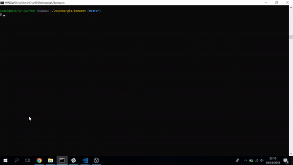
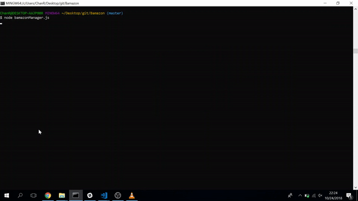
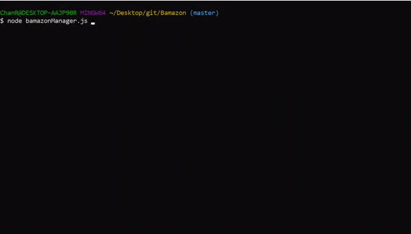

# Bamazon

Bamazon is an Amazon-like storefront using MySQL to create the database of the products. The `bamazonCustomer.js` app will take in orders from customers and deplete stock from the store's inventory. The `bamazonManager.js` app will allow the user to see the stocks for all products, the products with low stocks, the ability to increase stock, and the ability to add new products. 

### What Each App Would Do

#### `bamazonCustomer.js`

1. Running this application will first display all of the items available for sale. Include the ids, names, and prices of products for sale.

2. The app  prompt users with two messages.

   * The first should ask them the ID of the product they would like to buy.
        * If the ID chosen is not a valid product ID, the user will then be prompted to select the ID again.

   * The second message ask how many units of the product they would like to buy.

3. Once the customer has placed the order, your application checks if there are enough quantity of the product to meet the customer's request.

   * If not, the order will not go through.
   * If there is enough stock, the order will go through.
       * This means updating the SQL database to reflect the remaining quantity.
   * Once the update goes through, show the customer the total cost of their purchase.

4. DEMO:
    * 

#### `bamazonManager.js`
     
1. If a manager selects `View Products for Sale`, the app should list every available item: the item IDs, names, prices, and quantities.
    *  

2. If a manager selects `View Low Inventory`, then it should list all items with an inventory count lower than five.
    *  

3. If a manager selects `Add to Inventory`, your app should display a prompt that will let the manager "add more" of any item currently in the store.
    *  

4. If a manager selects `Add New Product`, it should allow the manager to add a completely new product to the store.
    *  
